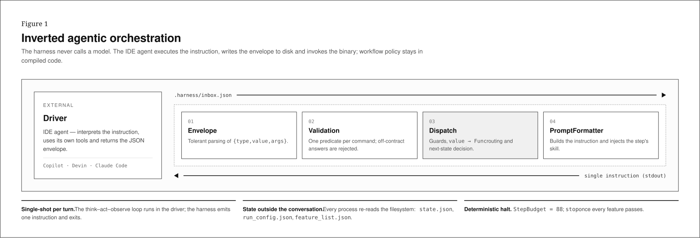
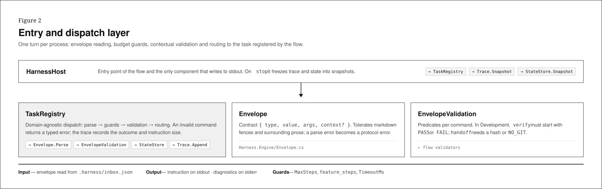
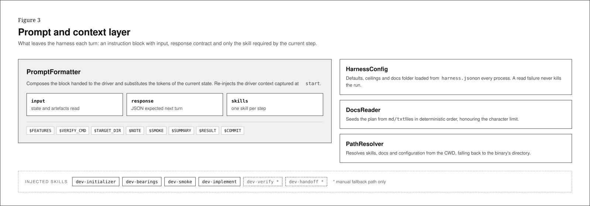
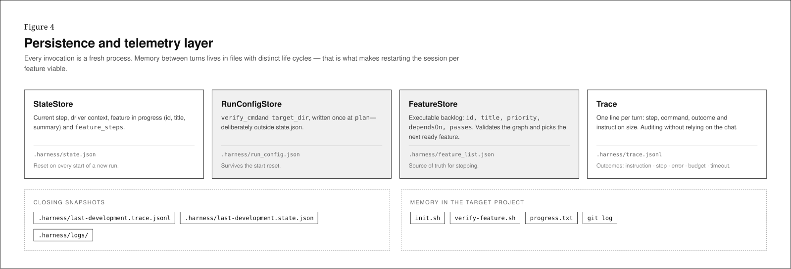
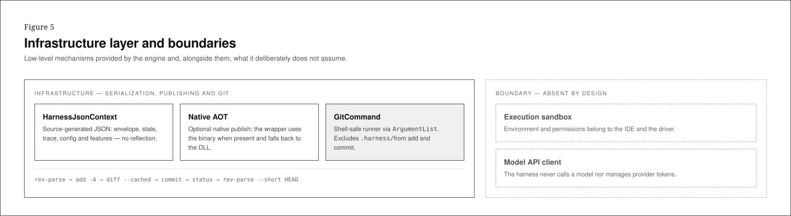
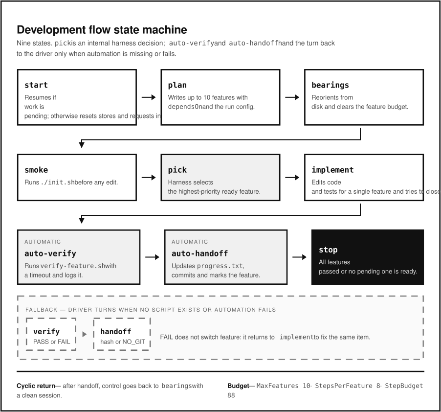
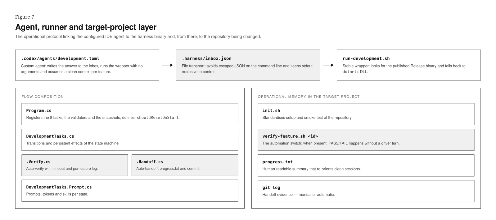
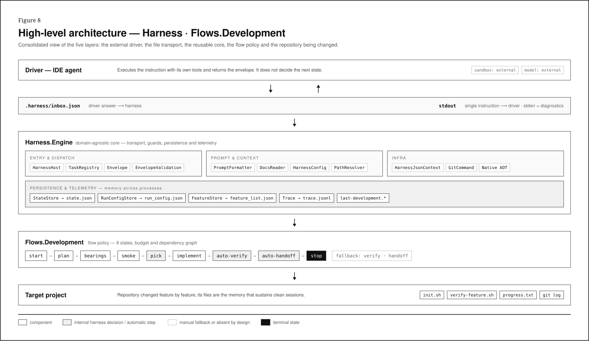

# Architecture

This document walks through the architecture of **Inverted Agentic Orchestration**
(IAO) as realized in this repository, layer by layer, using the eight reference
figures in `assets/images/`. Each figure is one layer of the system; together
they form the consolidated view in Figure 8 above.

For the pattern's formal definition (Intent, Motivation, Applicability,
Consequences, Known Uses) see [README.md](README.md). This document is the
structural companion: what each layer is, why it exists, and which files
implement it. An interactive, click-through version of the same material is
available in [`arquitetura-v2.html`](assets/arquitetura-v2.html) (Portuguese).

**Scope.** The walkthrough below follows the .NET implementation
(`src/dotnet/Harness.Engine` + `src/dotnet/Flows.Development`), the primary and
most complete realization in this repository. Protocol-compatible ports live in
`src/python`, `src/rust`, and `src/go`. Each engine owns its `run-development*.sh`
package template in the corresponding language directory; `package.sh` installs
the selected one as `run-development.sh` in the generated package — same
`.harness/` files, same inbox transport, same state machine.

## The pattern in one paragraph

The harness never calls a model. An IDE agent (the *driver* — Copilot, Devin,
Claude Code, Codex) runs the harness binary, reads the next instruction from
`stdout`, does the actual work with its own tools, and writes back a JSON
envelope. The harness — deterministic, compiled code — decides the next state,
validates the response against the command's contract, persists state to disk,
and records an execution trace. The driver's think–act–observe loop happens
once per turn; the harness is single-shot per process.

| Use this pattern when | Avoid it when |
|---|---|
| The workflow must be reproducible, auditable, or resumable | The task is a single stateless generation with no return contract |
| Execution spans multiple steps and may survive context resets | There is no real need to govern multiple iterations |
| The agent must follow structured contracts between turns | |
| The domain requires deterministic validation before advancing | |
| Different IDE agents need to drive the same protocol | |
| Step, time, or cost limits must be enforced by the system | |
| Workflow business logic should be testable outside the model | |

| Benefits | Costs / trade-offs |
|---|---|
| Testable as ordinary code | Requires maintaining a state machine and JSON contracts |
| State sequence no longer depends on model memory | Each new domain needs its own tasks, validators, and prompts |
| Resumable by a different agent using the same artifacts | Depends on the driver's discipline to respond only in the requested format |
| Protocol errors are detected early and handled explicitly | Very simple workflows may not justify the harness layer |
| Step/cost/timeout guards bound runaway loops | |
| The persisted trace is evidence for audit and evaluation | |
| Different adapters share the same runner and contract | |

**Participants → realization in this repo:**

| Pattern participant | Realized as | Where |
|---|---|---|
| Brief | Documents seeding the initial plan | `docs/*.md`, `docs/*.txt` |
| HarnessHost | Reusable flow entry point | `src/dotnet/Harness.Engine/HarnessHost.cs` |
| TaskRegistry | Envelope dispatch, guards, validation | `src/dotnet/Harness.Engine/TaskRegistry.cs` |
| Envelope | JSON contract between driver and harness | `src/dotnet/Harness.Engine/Envelope.cs` |
| DevelopmentTasks | Domain-specific state machine | `src/dotnet/Flows.Development/DevelopmentTasks*.cs` |
| Stores | `.harness/` persistence | `StateStore.cs`, `RunConfigStore.cs`, `FeatureStore.cs`, `Trace.cs` |
| IDE agent | Driver running the runner and responding in JSON | Codex, Claude Code, Copilot, Devin adapters |
| Project code | Target repository changed and verified | `target_dir/*` |

**Related patterns:** State Machine (explicit, deterministic state sequence),
Interpreter (the driver interprets harness-issued instructions), Command (each
envelope is a command with arguments and a response contract), Template Method
(`HarnessHost`/`TaskRegistry` provide the skeleton, each flow supplies its
tasks), Ports & Adapters (the shell runner and IDE adapters isolate the
protocol from the concrete driver), Workflow Engine / Process Manager (the
harness governs a long-running, persistent, reentrant execution).

---

## Figure 1 — Inverted Agentic Orchestration

The harness never calls a model. The driver writes the envelope to
`.harness/inbox.json`, invokes the binary, and gets back a single instruction on
`stdout`; workflow policy stays in compiled code, not in a prompt.

- **Single-shot per turn.** The think–act–observe loop runs in the *driver*; the
  harness process emits one instruction and exits.
- **State outside the conversation.** Every invocation re-reads the filesystem —
  `state.json`, `run_config.json`, `feature_list.json` — so a fresh context (a
  new session, a different driver) picks up exactly where the last one left
  off.
- **Deterministic halt.** `StepBudget = 88` for the Development flow; the
  harness stops once every feature passes, not on the model's judgment.

The four boxes in the middle of Figure 1 are the request pipeline inside a
single process: `Envelope` (tolerant parsing of `{type, value, args}`) →
`Validation` (one predicate per command; off-contract answers are rejected) →
`Dispatch` (guards, then `value → Func` routing) → `PromptFormatter` (builds the
next instruction and injects the current step's skill). These four are detailed
in Figures 2 and 3.

## Figure 2 — Entry and Dispatch Layer

One turn, one process: envelope reading, budget guards, contextual validation,
and routing to the task the flow registered.

- **`HarnessHost`** — the entry point of any flow, and the only component that
  writes to `stdout`. On `stop` it freezes the trace and state into snapshots
  before the process exits.
  (`src/dotnet/Harness.Engine/HarnessHost.cs`)
- **`TaskRegistry`** — domain-agnostic dispatch: parse → guards → validation →
  routing. An invalid command returns a *typed* error (not a silent stop), and
  the driver can correct and resend; the trace records the outcome and
  instruction size either way.
  (`src/dotnet/Harness.Engine/TaskRegistry.cs`)
- **`Envelope`** — the contract `{ type, value, args, context?, contextUsage? }`.
  `contextUsage` is optional driver telemetry; parsing
  tolerates markdown fences and prose around the JSON object; a parse failure
  becomes a protocol error, not a silent termination.
  (`src/dotnet/Harness.Engine/Envelope.cs`)
- **`EnvelopeValidation`** — cheap protocol predicates per command. In
  Development, the smoke/implement acknowledgements are only repair signals;
  verification and handoff are decided from process and repository state, not
  from driver-supplied PASS text or hashes.
  (`src/dotnet/Harness.Engine/EnvelopeValidation.cs`)

Guards enforced here, independent of any single flow: `MaxSteps` (global, from
`harness.json`, overridable per flow — Development overrides it with
`StepBudget`), `TimeoutMs` (a stuck task is run on a background thread and
cut off; the process still exits on `stop` even if the task never returns), and
`MaxInstructionChars` (an optional cost ceiling; `0` disables it).

## Figure 3 — Prompt and Context Layer

What leaves the harness each turn: an instruction block with `input`, a
`response` contract, and only the skill required by the current step.

- **`PromptFormatter`** — composes the block handed to the driver and
  substitutes the planning tokens (`$FEATURES`, `$VERIFY_CMD`, `$TARGET_DIR`). Later
  commands carry no model-authored evidence: summaries come from Git and verification/
  handoff are inspected deterministically. It
  re-injects the driver context captured at `start` (e.g. `{"driver": "codex"}`)
  into every output, so the harness never forgets who it is talking to.
  (`src/dotnet/Harness.Engine/PromptFormatter.cs`)
- **`HarnessConfig`** — defaults, ceilings, and the docs folder, loaded from
  `harness.json` on every process. A read failure never kills the run — it
  falls back to built-in defaults. `TimeoutMs` has a hard ceiling (10 minutes)
  that cannot be raised from `harness.json` alone, and cannot be disabled by setting
  zero or a negative value. A budget outcome latches the run terminal in persisted state
  before emitting `stop`; a timeout stops the current invocation but an explicit `start`
  clears its recoverable latch and allows the flow to resume or restart.
  (`src/dotnet/Harness.Engine/HarnessConfig.cs`)
- **`ContextPolicy`** — consumes only optional normalized context telemetry and
  decides whether the next feature gets a clean-context marker. It persists a
  ratio and feature counter, never provider-specific token records.
  (`src/dotnet/Harness.Engine/ContextPolicy.cs`)
- **`DocsReader`** — seeds the plan from `.md`/`.txt` files in deterministic
  order, honoring `docsMaxChars`.
  (`src/dotnet/Harness.Engine/DocsReader.cs`)
- **`PathResolver`** — resolves skills, docs, and configuration from the
  current working directory, falling back to the binary's own directory.
  (`src/dotnet/Harness.Engine/PathResolver.cs`)

Injected skills, one per driver turn: `dev-initializer`, `dev-implement`, and —
**repair path only** — `dev-smoke`, `dev-verify`, and `dev-handoff`. Bearings and
feature selection are internal harness work.

## Figure 4 — Persistence and Telemetry Layer

Every invocation is a fresh process. Memory between turns lives in files with
distinct life cycles — that is what makes restarting the session per feature
viable.

- **`StateStore`** — current step, driver context, the feature in progress
  (id, title, summary), and `feature_steps`. **Reset on every `start` of a new
  run.**
  (`src/dotnet/Harness.Engine/StateStore.cs` → `.harness/state.json`)
- **`RunConfigStore`** — `verify_cmd` and `target_dir`, written once at `plan`.
  Deliberately *outside* `state.json`: `TaskRegistry` resets `state.json`
  unconditionally on every `start`, but a resumed run (see Figure 6) still
  needs these two values for `smoke`/`verify` to work — so they live in a
  store with their own life cycle and **survive the `start` reset**.
  (`src/dotnet/Harness.Engine/RunConfigStore.cs` → `.harness/run_config.json`)
- **`FeatureStore`** — the executable backlog: `id`, `title`, `priority`,
  `dependsOn`, `passes`. Validates the dependency graph on `plan` (rejects
  dangling references and cycles via a topological check) and, on `pick`,
  selects the highest-priority feature among the ones that are actually
  *ready* — every id in its `dependsOn` already passed.
  (`src/dotnet/Harness.Engine/FeatureStore.cs` → `.harness/feature_list.json`)
- **`Trace`** — one line per turn: step, command, outcome
  (`instruction`/`stop`/`error`/`budget`/`timeout`), instruction size, and,
  when available, context window, context usage, and normalized usage ratio.
  This is the audit trail — evidence that doesn't depend on chat history.
  (`src/dotnet/Harness.Engine/Trace.cs` → `.harness/trace.jsonl`)

**Closing snapshots**, written only when the flow emits `stop`, so a later
evaluation reads a stable file instead of one the next run has already reset:
`.harness/last-development.trace.jsonl`, `.harness/last-development.state.json`,
plus per-step logs under `.harness/logs/`.

**Memory in the target project** — outside `.harness/`, inside the repository
being changed: `init.sh`, `verify-feature.sh`, `progress.txt`, `git log`. These
are what makes a hard-reset session viable: a fresh context re-orients from
disk, not from conversation history.

## Figure 5 — Infrastructure Layer and Boundaries

Low-level mechanisms the engine provides — and, just as deliberately, what it
does not assume.

- **`HarnessJsonContext`** — source-generated JSON (envelope, state, trace,
  config, features) so serialization survives Native AOT without reflection.
  (`src/dotnet/Harness.Engine/HarnessJsonContext.cs`)
- **Native AOT** — an optional native publish; `run-development.sh` uses the
  compiled binary when present and falls back to `dotnet` + DLL otherwise (and
  builds the DLL on demand if neither exists yet).
- **`GitCommand`** — a small, shell-safe runner for git (`ArgumentList`, no
  shell string interpolation), used by the Development flow's auto-handoff:
  `rev-parse → add -A → diff --cached → commit → status → rev-parse --short
  HEAD`, always excluding `.harness/` from `add`/`diff`/`commit`.
  (`src/dotnet/Harness.Engine/GitCommand.cs`)

**Absent by design** — the boundary the engine deliberately does not cross:

- **Execution sandbox** — the environment and permissions belong to the IDE
  and the driver, not the harness.
- **Model API client** — the harness never calls a model or manages provider
  tokens; the driver *is* the model call.

## Figure 6 — Flow Layer: the Flows.Development State Machine

Eight protocol commands remain available for compatibility, but the normal
path has only the planning and implementation driver turns. `bearings`,
`smoke`, and `pick` are executed internally; `verify` and `handoff` return to
the driver only when automated repair is needed. Each new `implement` prompt
begins with `=== NEW SESSION (clean context) ===` when the adaptive context
policy requests it, which is the driver-facing boundary for the fresh context
of the next feature; retries for the same feature do not emit it. Drivers may
optionally attach `contextUsage` telemetry to the envelope. The engine consumes
only the generic window/used-token fields and never parses provider-specific
rollout storage; in its absence, the configured deterministic fallback remains
active. A host adapter can supply the canonical object in the response envelope
or through `HARNESS_CONTEXT_USAGE_JSON` for the current turn. The Codex-specific
bridge is isolated in `.harness/scripts/codex_context_usage.py`, which delegates parsing
to `.harness/scripts/codex_usage.py`; this provider coupling does not enter the engine.
Claude Code and Copilot use the same adapter boundary; when their host does not
expose a reliable context window, those adapters intentionally emit no sample
and the deterministic fallback remains active.

| State | What happens |
|---|---|
| `start` | Resumes by reconstructing bounded repository context if a feature is still pending; otherwise resets `FeatureStore`/`RunConfigStore` and asks for the init (from `docs/` or interactively) |
| `plan` | Writes up to `MaxFeatures = 10` features, each with `dependsOn`, plus the run config (`verify_cmd`, `target_dir`), then starts deterministic session setup |
| `bearings` | Internal compatibility command: captures the `progress.txt` tail and `git log`, then continues automatically |
| `smoke` | Internal compatibility command: runs `./init.sh` with timeout and exit-code classification before selecting a feature |
| `pick` | **Harness decision, no driver input.** Selects the highest-priority feature among the ones whose dependencies already passed |
| `implement` | Edits code and tests for the selected feature, then **tries to close it automatically** |
| *auto-verify* | The harness runs `verify-feature.sh`, or the configured `verify_cmd` when the script is absent, with timeout and logs — no driver turn spent |
| *auto-handoff* | On a pass, the harness updates `progress.txt`, commits via `GitCommand`, and marks the feature — again, no driver turn |
| `stop` | When every feature passes, or no pending feature is ready (blocked by an unmet dependency) |

**Fallback path** — `verify` and `handoff` are only requested as repair turns
when the harness cannot complete the configured operation. The harness executes
the configured verification command without a shell and decides from its exit
code; textual `PASS` or commit hashes are not evidence. A failed verification
always routes back to `implement` for the same feature.

**Cyclic return** — after a successful handoff, the harness reconstructs the
bounded bearings context and starts the next feature without a separate driver
turn. The resulting `implement` instruction carries the explicit clean-context
marker, so a driver that supports the long-running-agent adapter can open a new
session while recovering the feature context from persistent artifacts.

**Budget** — `MaxFeatures = 10`, `StepsPerFeature = 8`,
`StepBudget = 10 × 8 + 8 = 88`, passed to `HarnessHost.Run` as the effective
`maxSteps` override for this flow.

(`src/dotnet/Flows.Development/DevelopmentTasks.cs`,
`DevelopmentTasks.Verify.cs`, `DevelopmentTasks.Handoff.cs`)

## Figure 7 — Agent, Runner and Target-Project Layer

The operational protocol linking the configured IDE agent to the harness
binary and, from there, to the repository being changed.

- **`.codex/agents/development.toml`** — the custom agent: writes the answer
  to the inbox, runs the wrapper with no arguments, and assumes a clean context
  per feature. Equivalent adapters exist for other drivers:
  `.claude/agents/development.agent.md` (Claude Code),
  `.github/prompts/development.prompt.md` (GitHub Copilot), and
  `.devin/workflows/development.md` (Devin) — same protocol, different driver.
- **`.harness/inbox.json`** — file transport. Avoids escaped JSON on the
  command line (one forgotten quote can hang a shell before the program even
  runs) and keeps `stdout` exclusive to control.
- **`run-development.sh`** — the stable wrapper at the root of a generated
  package. Its engine-specific template lives in `src/dotnet`, `src/python`,
  `src/rust`, or `src/go` and is copied into place by `package.sh`.

**Flow composition** (what registers the state machine in Figure 6):

- `Program.cs` — registers the 8 tasks, the validators, and the snapshot
  paths; defines `shouldResetOnStart`.
- `DevelopmentTasks.cs` — transitions and persistent effects of the state
  machine.
- `DevelopmentTasks.Verify.cs` — deterministic smoke/verify execution, with
  timeout and per-step logs under `.harness/logs/`.
- `DevelopmentTasks.Handoff.cs` — auto-handoff: `progress.txt` and commit via
  `GitCommand`.
- `DevelopmentTasks.Prompt.cs` — prompts, tokens, and skills per state.

**Operational memory in the target project** — the files a fresh session reads
before touching code: `init.sh` (setup and smoke test), `verify-feature.sh
<id>` (the preferred feature-specific verifier), `progress.txt` (human-readable
summary), `git log` (handoff evidence, validated by the harness).

## Figure 8 — High-Level Architecture (Consolidated View)

The five layers stacked, top to bottom:

- **A · Driver** — the IDE agent. Executes the instruction with its own tools
  and returns the envelope. It does not decide the next state. Sandbox and
  model are both external to the harness.
- **B · Transport** — `.harness/inbox.json` (driver → harness) and `stdout`
  (harness → driver, single instruction; `stderr` carries diagnostics only).
- **C · Harness.Engine** — the domain-agnostic core: entry & dispatch (Figure
  2), prompt & context (Figure 3), infra (Figure 5), and persistence &
  telemetry (Figure 4).
- **D · Flow** — `Flows.Development`'s policy: the 8-state machine, the step
  budget, and the dependency graph (Figure 6).
- **E · Target project** — the repository being changed feature by feature;
  its own files (`init.sh`, `verify-feature.sh`, `progress.txt`, `git log`) are
  the memory that sustains clean sessions.

The legend at the bottom of Figure 8 is worth internalizing, since it recurs
across Figures 1–7 as well: a plain box is a component; a shaded box is an
internal harness decision or an automatic step (no driver turn spent); a
dashed box is a manual fallback path, or something absent by design; a filled
black box is a terminal state.

## See Also

- [README.md](README.md) — the pattern's formal definition: Intent, Motivation,
  Applicability, Consequences, Implementation, Known Uses, Related Patterns,
  and the `GF-V2` experiment.
- [`arquitetura-v2.html`](arquitetura-v2.html) — interactive, click-through
  version of this architecture (Portuguese).
- `src/dotnet/Harness.Engine/` — the reusable core described in Figures 1, 2,
  3, 4, and 5.
- `src/dotnet/Flows.Development/` — the state machine described in Figures 6
  and 7.
- `src/python/` — the protocol-compatible Python port and its package wrapper.
- `src/rust/` — the protocol-compatible Rust port and its package wrapper.
- `src/go/` — the protocol-compatible Go port and its package wrapper.

## References

- IBM. *Loop engineering*. IBM Think. https://www.ibm.com/think/topics/loop-engineering
  — the broader discipline of designing the iteration loop itself (bounds,
  checkpoints, exit conditions) that the step/feature budgets, guards, and the
  `stop` terminal state (Figures 2 and 6) are an instance of.
- Anthropic. *Building effective agents*. Anthropic Engineering.
  https://www.anthropic.com/engineering/building-effective-agents — the
  workflow-vs-agent framing (composing predictable, code-defined steps instead
  of leaving control flow entirely to the model) behind putting the state
  machine in compiled code rather than in a prompt (Figures 1, 2, and 6).
- Anthropic. *Effective harnesses for long-running agents*. Anthropic
  Engineering. https://www.anthropic.com/engineering/effective-harnesses-for-long-running-agents
  — the long-running-agent harness pattern (a fresh session per unit of work,
  state in persistent artifacts instead of conversation memory, deterministic
  verification before advancing) that `Flows.Development`'s state machine
  (Figure 6) implements.
- Justino, Y. (2026). *Inverted Orchestration in Software Development: A
  Deterministic Harness and Looping Engineering under Enterprise Constraints*
  (Version v0.1.0). Zenodo. https://doi.org/10.5281/zenodo.21421908
