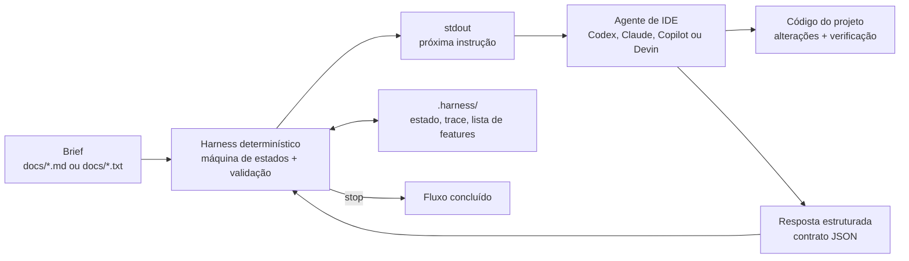

# Orquestração Agêntica Invertida

## Intenção

**Orquestração Agêntica Invertida** é um padrão para conduzir agentes de IA por
meio de uma máquina de estados determinística implementada em código, em vez de
embutir a orquestração em prompts, cadeias frágeis de instruções ou SDKs de
modelo.

O agente atua como um intérprete operacional: executa o harness, lê a próxima
instrução em `stdout`, cumpre o contrato pedido e devolve uma resposta
estruturada. O harness decide o próximo estado, valida respostas, persiste o
estado em disco e registra o trace da execução.

## Motivação

Fluxos longos com agentes de IA tendem a perder previsibilidade quando a lógica
de controle fica dentro da conversa. O modelo pode esquecer etapas, pular
validações, repetir ações, encerrar cedo demais ou não manter evidências
suficientes para auditoria.

A inversão resolve esse problema deslocando a autoridade do fluxo para código
determinístico. O agente continua fazendo o trabalho criativo e operacional,
mas a sequência de estados, os contratos de entrada e saída, os limites de
custo, as retomadas e o encerramento ficam sob responsabilidade do harness.

Neste repositório, a motivação concreta é o fluxo **development**: transformar
um brief em `docs/` em uma lista priorizada de features e guiar a implementação
de uma feature por vez até que tudo passe na verificação.

## Aplicabilidade

Use este padrão quando:

- o fluxo com IA precisa ser reproduzível, auditável ou retomável;
- a execução passa por várias etapas e pode sobreviver a resets de contexto;
- o agente deve seguir contratos estruturados entre cada rodada;
- o domínio exige validação determinística antes de avançar;
- diferentes agentes de IDE precisam dirigir o mesmo protocolo;
- limites de passos, tempo ou custo precisam ser impostos pelo sistema;
- a lógica de negócio do workflow deve ser testável fora do modelo.

Evite este padrão quando a tarefa é uma geração isolada, sem estado, sem
contrato de retorno e sem necessidade real de governar várias iterações.

## Estrutura



Fluxo de desenvolvimento:

```text
start -> plan -> [bearings -> smoke -> pick -> implement -> verify -> handoff]* -> stop
```

O harness é a fronteira de protocolo. O agente não escolhe o próximo estado por
conta própria; ele responde ao estado solicitado, grava ou envia um envelope
JSON e executa novamente o runner para receber a próxima instrução.

## Participantes

- **Brief**: documentos em `docs/*.md` ou `docs/*.txt` que descrevem o que deve
  ser construído.
- **HarnessHost**: ponto de entrada reutilizável do flow; executa o dispatch,
  publica a saída no `stdout` e fotografa estado e trace ao terminar.
- **TaskRegistry**: interpreta envelopes, valida comandos, aplica guardas de
  passos, custo e tempo, e encaminha cada comando para a task correta.
- **Envelope**: contrato JSON trocado entre agente e harness, com `type`,
  `value`, `args` e contexto opcional.
- **DevelopmentTasks**: máquina de estados específica do fluxo de
  desenvolvimento.
- **Stores em `.harness/`**: persistem estado, trace, lista de features, inbox e
  configuração de execução.
- **Agente de IDE**: Codex, Claude Code, GitHub Copilot, Devin ou outro driver
  que consiga executar o runner, ler `stdout` e responder em JSON.
- **Código do projeto**: alvo alterado e verificado pelo agente durante as
  etapas de implementação.

## Colaborações

1. O usuário coloca um brief em `docs/`.
2. O agente inicia o fluxo enviando o envelope `start`.
3. O harness lê os documentos, emite a instrução de planejamento e pede uma
   lista estruturada de features.
4. O agente devolve a lista; o harness a valida, limita e persiste em
   `.harness/feature_list.json`.
5. Para cada feature pronta, o harness conduz o ciclo `bearings -> smoke ->
   pick -> implement -> verify`.
6. Se a verificação falhar, o harness retorna para implementação da mesma
   feature dentro dos limites configurados.
7. Quando a feature passa, o harness executa o handoff, marca a feature como
   concluída e seleciona a próxima.
8. Quando não há mais features pendentes, o harness emite `stop`.

Erros de protocolo não encerram silenciosamente o fluxo. O harness devolve uma
mensagem corretiva com os comandos válidos para que o agente corrija o envelope
e tente novamente.

## Consequências

Benefícios:

- o workflow fica testável como código comum;
- a sequência de estados deixa de depender da memória do modelo;
- a execução pode ser retomada por outro agente usando os mesmos artefatos;
- erros de protocolo são detectados cedo e tratados de forma explícita;
- guardas de passos, custo e timeout reduzem loops indefinidos;
- o trace persistido cria evidência para auditoria e avaliação posterior;
- adaptadores diferentes podem compartilhar o mesmo runner e o mesmo contrato.

Custos e trade-offs:

- o projeto precisa manter uma máquina de estados e contratos JSON;
- cada novo domínio exige tasks, validações e prompts específicos;
- a experiência depende da disciplina do agente em responder apenas no formato
  solicitado;
- workflows muito simples podem não justificar a camada de harness.

## Implementação

Este repositório inclui duas implementações compatíveis do protocolo:

| Runner | Requisito | Observações |
|---|---|---|
| `./run-development.sh` | SDK .NET compatível com `net10.0`, exceto quando um binário Native AOT já tiver sido publicado | Runner padrão usado pelos adaptadores de IDE incluídos. Compila a DLL sob demanda quando necessário. |
| `./run-development-py.sh` | Python 3.11+ | Porta Python compatível com o protocolo. Usa os mesmos arquivos em `.harness/` e o mesmo transporte por inbox. |

O arquivo `harness.json` configura limites globais como `maxSteps`,
`maxInstructionChars`, `docsMaxChars`, `docsFolder` e `timeoutMs`.

Os adaptadores incluídos chamam `./run-development.sh` por padrão:

| Agente | Adaptador |
|---|---|
| Codex | `.codex/agents/development.toml` |
| Claude Code | `.claude/agents/development.agent.md` |
| GitHub Copilot | `.github/prompts/development.prompt.md` |
| Devin | `.devin/workflows/development.md` |

Para rodar via Python, aponte o agente para `./run-development-py.sh` mantendo o
mesmo protocolo em `.harness/inbox.json`.

## Exemplo de uso

Uso pretendido com agente de IDE:

1. Coloque o brief em `docs/`.
2. Peça ao agente da IDE para usar o fluxo `development`.
3. O agente escreve o envelope `start` em `.harness/inbox.json`.
4. O agente executa o runner selecionado sem argumentos.
5. O agente lê o `stdout`, realiza a ação solicitada e responde no formato JSON
   pedido.
6. O harness conduz os próximos passos até emitir `stop`.

Checagem manual do protocolo:

```bash
./run-development.sh '{ "type": "text", "value": "start" }'
./run-development-py.sh '{ "type": "text", "value": "start" }'
```

Verificação local:

```bash
./run-checks.sh
./run-checks-py.sh
```

## Usos conhecidos

- **Fluxo development deste repositório**: transforma briefs em features
  priorizadas e conduz implementação incremental com verificação.
- **Porta .NET**: implementação principal do harness e do flow.
- **Porta Python**: implementação compatível para ambientes onde Python é a
  melhor opção operacional.
- **Adaptadores de IDE**: Codex, Claude Code, GitHub Copilot e Devin usando o
  mesmo protocolo de runner e inbox.

Referência:

Justino, Y. (2026). *Inverted Orchestration in Software Development: A
Deterministic Harness and Looping Engineering under Enterprise Constraints*
(Version v0.1.0). Zenodo. https://doi.org/10.5281/zenodo.21421908

```bibtex
@misc{justino_2026_21421908,
  author    = {Justino, Yan},
  title     = {Inverted Orchestration in Software Development: A Deterministic Harness and Looping Engineering under Enterprise Constraints},
  year      = {2026},
  month     = jul,
  publisher = {Zenodo},
  version   = {v0.1.0},
  doi       = {10.5281/zenodo.21421908},
  url       = {https://doi.org/10.5281/zenodo.21421908}
}
```

## Padrões relacionados

- **State Machine**: a sequência de estados é explícita e determinística.
- **Interpreter**: o agente interpreta instruções emitidas pelo harness e
  devolve respostas estruturadas.
- **Command**: cada envelope representa um comando com argumentos e contrato de
  resposta.
- **Template Method**: `HarnessHost` e `TaskRegistry` fornecem o esqueleto
  comum, enquanto cada flow define suas tasks de domínio.
- **Ports and Adapters**: o runner de shell e os adaptadores de IDE isolam o
  protocolo do agente concreto.
- **Workflow Engine / Process Manager**: o harness governa uma execução longa,
  persistente e reentrante.
