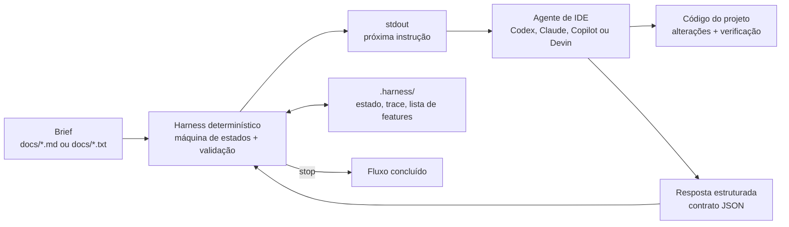

## Definição

**Orquestração Agêntica Invertida** é um padrão em que a orquestração não vive
em um prompt nem em um SDK de modelo. Ela vive em uma máquina de estados
determinística implementada em código.

O agente de IA atua como um intérprete operacional. A cada passo, ele executa o
harness, lê o `stdout`, segue o contrato solicitado e devolve uma resposta
estruturada. O harness decide o próximo estado, valida respostas, persiste
estado em disco e registra o trace da execução.

Neste repositório, o fluxo principal é o **development**: ele transforma um
brief em `docs/` em uma lista priorizada de features e conduz a implementação
de uma feature por vez até que tudo passe.

## Diagrama



Fluxo de desenvolvimento:

```text
start -> plan -> [bearings -> smoke -> pick -> implement -> verify -> handoff]* -> stop
```

## Como Usar

IAO foi pensado para ser iniciado por um agente de IDE. O runner de shell é a
fronteira de protocolo que o agente dirige; a invocação direta pelo shell serve
principalmente para debug local.

1. Coloque o brief em `docs/`.
2. Peça ao agente da IDE para usar o fluxo `development`.
3. O agente escreve o envelope `start` em `.harness/inbox.json`.
4. O agente executa o runner selecionado sem argumentos, lê o `stdout` e
   responde no formato JSON solicitado.
5. O harness conduz os próximos passos até emitir `stop`.

Opções de runtime:

| Runner | Requisito | Observações |
|---|---|---|
| `./run-development.sh` | SDK .NET compatível com `net10.0`, exceto quando um binário Native AOT já tiver sido publicado | Runner padrão usado pelos adaptadores de IDE incluídos. Compila a DLL sob demanda quando necessário. |
| `./run-development-py.sh` | Python 3.11+ | Porta Python compatível com o protocolo. Usa os mesmos arquivos em `.harness/` e o mesmo transporte por inbox. |

Adaptadores de IDE incluídos:

| Agente | Adaptador |
|---|---|
| Codex | `.codex/agents/development.toml` |
| Claude Code | `.claude/agents/development.agent.md` |
| GitHub Copilot | `.github/prompts/development.prompt.md` |
| Devin | `.devin/workflows/development.md` |

Os adaptadores incluídos chamam `./run-development.sh` por padrão. Para rodar
via Python, aponte o agente para `./run-development-py.sh` mantendo o mesmo
protocolo em `.harness/inbox.json`.

Checagem manual do protocolo:

```bash
./run-development.sh '{ "type": "text", "value": "start" }'
./run-development-py.sh '{ "type": "text", "value": "start" }'
```

Verificação local:

```bash
./run-checks.sh
./run-checks-py.sh
```

## Referência

Justino, Y. (2026). *Inverted Orchestration in Software Development: A
Deterministic Harness and Looping Engineering under Enterprise Constraints*
(Version v0.1.0). Zenodo. https://doi.org/10.5281/zenodo.21421908

```bibtex
@misc{justino_2026_21421908,
  author    = {Justino, Yan},
  title     = {Inverted Orchestration in Software Development: A Deterministic Harness and Looping Engineering under Enterprise Constraints},
  year      = {2026},
  month     = jul,
  publisher = {Zenodo},
  version   = {v0.1.0},
  doi       = {10.5281/zenodo.21421908},
  url       = {https://doi.org/10.5281/zenodo.21421908}
}
```
