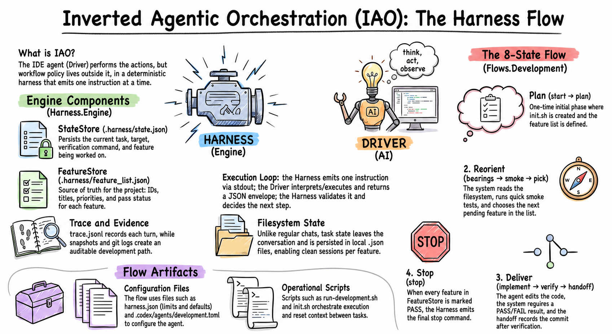
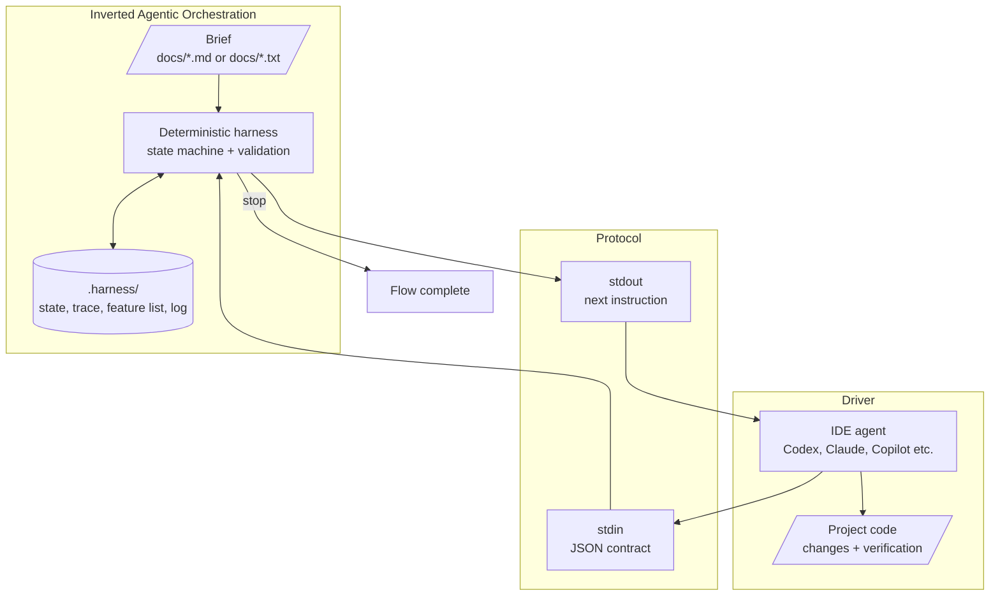

# Inverted Agentic Orchestration

## Intent

**Inverted Agentic Orchestration** is a pattern for driving AI agents through a
deterministic state machine implemented in code, instead of embedding
orchestration in prompts, fragile instruction chains, or model SDKs.

The agent acts as an operational interpreter: it runs the harness, reads the
next instruction from `stdout`, follows the requested contract, and returns a
structured response. The harness decides the next state, validates responses,
persists state on disk, and records the execution trace.

## Motivation

Long-running AI agent workflows tend to lose predictability when control logic
lives inside the conversation. The model can forget steps, skip validations,
repeat actions, stop too early, or fail to preserve enough evidence for audit.

The inversion moves authority over the flow into deterministic code. The agent
still performs the creative and operational work, but the state sequence, input
and output contracts, cost limits, resumability, and termination are owned by
the harness.

In this repository, the concrete motivation is the **development** flow: it
turns a brief in `docs/` into a prioritized feature list and guides
implementation one feature at a time until everything passes verification.

## Applicability

Use this pattern when:

- the AI workflow must be reproducible, auditable, or resumable;
- execution spans multiple steps and may survive context resets;
- the agent must follow structured contracts between each turn;
- the domain requires deterministic validation before advancing;
- different IDE agents need to drive the same protocol;
- step, time, or cost limits must be enforced by the system;
- workflow business logic should be testable outside the model.

Avoid this pattern when the task is a single stateless generation with no return
contract and no real need to govern multiple iterations.

## Structure



Development flow:

```text
start -> plan -> [bearings -> smoke -> pick -> implement -> verify -> handoff]* -> stop
```

The harness is the protocol boundary. The agent does not choose the next state
on its own; it responds to the requested state, writes or sends a JSON envelope,
and runs the runner again to receive the next instruction.

## Participants

- **Brief**: documents in `docs/*.md` or `docs/*.txt` that describe what should
  be built.
- **HarnessHost**: reusable flow entry point; runs dispatch, publishes output
  to `stdout`, and snapshots state and trace when the flow stops.
- **TaskRegistry**: parses envelopes, validates commands, applies step, cost,
  and time guards, and dispatches each command to the proper task.
- **Envelope**: JSON contract exchanged between agent and harness, with `type`,
  `value`, `args`, and optional context.
- **DevelopmentTasks**: development-specific state machine.
- **Stores in `.harness/`**: persist state, trace, feature list, inbox, and run
  configuration.
- **IDE agent**: Codex, Claude Code, GitHub Copilot, Devin, or another driver
  able to run the runner, read `stdout`, and respond in JSON.
- **Project code**: the target changed and verified by the agent during
  implementation steps.

## Collaborations

1. The user places a brief in `docs/`.
2. The agent starts the flow by sending the `start` envelope.
3. The harness reads the documents, emits the planning instruction, and asks
   for a structured feature list.
4. The agent returns the list; the harness validates it, caps it, and persists
   it to `.harness/feature_list.json`.
5. For each ready feature, the harness drives the `bearings -> smoke -> pick ->
   implement -> verify` cycle.
6. If verification fails, the harness returns to implementation for the same
   feature within the configured limits.
7. When the feature passes, the harness performs the handoff, marks the feature
   as complete, and selects the next one.
8. When no pending features remain, the harness emits `stop`.

Protocol errors do not silently terminate the flow. The harness returns a
corrective message with the valid commands so the agent can fix the envelope and
try again.

## Consequences

Benefits:

- the workflow is testable as ordinary code;
- the state sequence no longer depends on model memory;
- execution can be resumed by another agent using the same artifacts;
- protocol errors are detected early and handled explicitly;
- step, cost, and timeout guards reduce indefinite loops;
- the persisted trace creates evidence for audit and later evaluation;
- different adapters can share the same runner and contract.

Costs and trade-offs:

- the project must maintain a state machine and JSON contracts;
- each new domain requires domain-specific tasks, validations, and prompts;
- the experience depends on the agent's discipline in responding only in the
  requested format;
- very simple workflows may not justify the harness layer.

## Implementation

This repository includes two protocol-compatible implementations:

| Runner | Requirement | Notes |
|---|---|---|
| `./run-development.sh` | .NET SDK compatible with `net10.0`, unless a Native AOT binary was already published | Default runner used by the included IDE adapters. Builds the DLL on demand when needed. |
| `./run-development-py.sh` | Python 3.11+ | Protocol-compatible Python port. Uses the same `.harness/` files and inbox transport. |

The `harness.json` file configures global limits such as `maxSteps`,
`maxInstructionChars`, `docsMaxChars`, `docsFolder`, and `timeoutMs`.

The included adapters call `./run-development.sh` by default:

| Agent | Adapter |
|---|---|
| Codex | `.codex/agents/development.toml` |
| Claude Code | `.claude/agents/development.agent.md` |
| GitHub Copilot | `.github/prompts/development.prompt.md` |
| Devin | `.devin/workflows/development.md` |

To run through Python, point the agent to `./run-development-py.sh` while
keeping the same `.harness/inbox.json` protocol.

## Example Usage

Intended IDE-agent usage:

1. Put the brief in `docs/`.
2. Ask the IDE agent to use the `development` flow.
3. The agent writes the `start` envelope to `.harness/inbox.json`.
4. The agent runs the selected runner with no arguments.
5. The agent reads `stdout`, performs the requested action, and responds in the
   requested JSON format.
6. The harness drives the next steps until it emits `stop`.

Manual protocol check:

```bash
./run-development.sh '{ "type": "text", "value": "start" }'
./run-development-py.sh '{ "type": "text", "value": "start" }'
```

Local verification:

```bash
./run-checks.sh
./run-checks-py.sh
```

## Known Uses

- **This repository's development flow**: turns briefs into prioritized
  features and drives incremental implementation with verification.
- **.NET port**: primary implementation of the harness and flow.
- **Python port**: compatible implementation for environments where Python is
  the better operational choice.
- **IDE adapters**: Codex, Claude Code, GitHub Copilot, and Devin using the
  same runner and inbox protocol.

## Related Patterns

- **State Machine**: the state sequence is explicit and deterministic.
- **Interpreter**: the agent interprets instructions emitted by the harness and
  returns structured responses.
- **Command**: each envelope represents a command with arguments and a response
  contract.
- **Template Method**: `HarnessHost` and `TaskRegistry` provide the common
  skeleton, while each flow defines its domain tasks.
- **Ports and Adapters**: the shell runner and IDE adapters isolate the
  protocol from the concrete agent.
- **Workflow Engine / Process Manager**: the harness governs a long-running,
  persistent, and reentrant execution.

## Experiment

The `GF-V2` experiment compares two IDE drivers running the development harness,
using the generated session reports as evidence.

**Feature context**: the experiment
target was a .NET `net10.0` Todo Web API backed by a real Postgres database,
organized as vertical slices and verified with unit and integration tests.
Session 0 scaffolded the solution, shell runners, and test projects. The core
backlog then delivered eight features:

1. Postgres infrastructure with `docker-compose.yml`, healthcheck, persistent
   volume, and automatic `tasks` schema creation.
2. `POST /tasks` to add a task, validating that the title is present and
   persisting new tasks with `pending` status.
3. `GET /tasks` to list tasks from Postgres, ordered by id.
4. `PATCH /tasks/{id}/complete` to transition a task to `completed`, returning
   `404` for unknown ids.
5. Persistence across API process restarts, verified by integration tests
   against the same Postgres database.
6. `DELETE /tasks/{id}` to remove a task, returning `404` for unknown ids.
7. `PUT /tasks/{id}` to edit a task title, rejecting blank titles with `400`
   and unknown ids with `404`.
8. `GET /tasks?status=...` to filter by `pending` or `completed`, returning
   all tasks when the filter is absent or blank and `400` for invalid values.

The same progress log also records a notification-email delta after the core
Todo backlog: an `EmailNotifier` component builds status-change email content
and resolves sender/recipient from environment variables, and
`PATCH /tasks/{id}/complete` sends a best-effort synchronous email through an
`ISmtpEmailClient` abstraction. The final recorded delta verification passed 43
unit tests and 20 integration tests.

### Summary:

| Driver | Session | Model | Steps | Errors | Duration | Total tokens | Attributed cost | Total session cost | Average cost / step |
|---|---|---|---:|---:|---:|---:|---:|---:|---:|
| Codex CLI | `019f9021` | `gpt-5.5` | 35 | 0 | 24m 36s | 13,467,746 | $8.93 | $9.08 | $0.26 |
| Claude Code | `90c48615` | `claude-sonnet-5` | 34 | 0 | 34m 12s | 21,055,922 | $8.21 | $8.33 | $0.24 |

Cost by harness command:

| Command | Codex CLI | Claude Code |
|---|---:|---:|
| `implement` | 9 steps, $4.40 | 8 steps, $3.37 |
| `bearings` | 8 steps, $1.28 | 8 steps, $2.84 |
| `plan` | 1 step, $0.79 | 1 step, $1.44 |
| `smoke` | 8 steps, $1.58 | 8 steps, $0.31 |
| `pick` | 8 steps, $0.76 | 8 steps, $0.12 |
| `start` | 1 step, $0.12 | 1 step, $0.14 |

Both sessions completed with zero harness protocol errors. Codex finished the
traced run faster, while Claude had the lower estimated total cost despite a
higher token count. The reports also record unassigned post-trace usage:
254,945 tokens ($0.15) for Codex and 335,019 tokens ($0.12) for Claude. Costs
are estimates from the public pricing table embedded in the reporting scripts;
Claude tool-call and token-event telemetry was not populated in this report
version.

## References

Justino, Y. (2026). *Inverted Orchestration in Software Development: A
Deterministic Harness and Looping Engineering under Enterprise Constraints*
(Version v0.1.0). Zenodo. https://doi.org/10.5281/zenodo.21421908

```bibtex
@misc{justino_2026_21421908,
  author    = {Justino, Yan},
  title     = {Inverted Orchestration in Software Development: A Deterministic Harness and Looping Engineering under Enterprise Constraints},
  year      = {2026},
  month     = jul,
  publisher = {Zenodo},
  version   = {v0.1.0},
  doi       = {10.5281/zenodo.21421908},
  url       = {https://doi.org/10.5281/zenodo.21421908}
}
```
