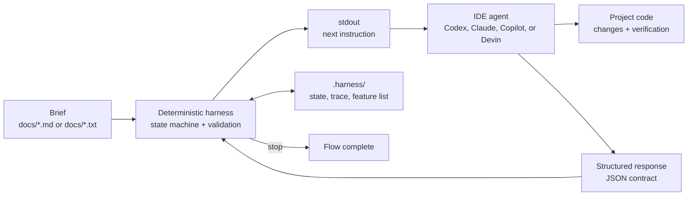

## Definition

**Inverted Agentic Orchestration** is a pattern where orchestration does not
live in a prompt or model SDK. It lives in a deterministic state machine
implemented in code.

The AI agent acts as an operational interpreter. At each step, it runs the
harness, reads `stdout`, follows the requested contract, and returns a
structured response. The harness decides the next state, validates responses,
persists state on disk, and records the execution trace.

In this repository, the main flow is **development**: it turns a brief in
`docs/` into a prioritized feature list and guides implementation one feature
at a time until everything passes.

## Diagram



Development flow:

```text
start -> plan -> [bearings -> smoke -> pick -> implement -> verify -> handoff]* -> stop
```

## How to Use

IAO is meant to be started by an IDE agent. The shell runner is the protocol
boundary the agent drives; direct shell invocation is mainly useful for local
debugging.

1. Put the brief in `docs/`.
2. Ask the IDE agent to use the `development` flow.
3. The agent writes the `start` envelope to `.harness/inbox.json`.
4. The agent runs the selected runner with no arguments, reads `stdout`, and
   responds in the requested JSON format.
5. The harness drives the next steps until it emits `stop`.

Runtime options:

| Runner | Requirement | Notes |
|---|---|---|
| `./run-development.sh` | .NET SDK compatible with `net10.0`, unless a Native AOT binary was already published | Default runner used by the included IDE adapters. Builds the DLL on demand when needed. |
| `./run-development-py.sh` | Python 3.11+ | Protocol-compatible Python port. Uses the same `.harness/` files and inbox transport. |

Included IDE adapters:

| Agent | Adapter |
|---|---|
| Codex | `.codex/agents/development.toml` |
| Claude Code | `.claude/agents/development.agent.md` |
| GitHub Copilot | `.github/prompts/development.prompt.md` |
| Devin | `.devin/workflows/development.md` |

The included adapters call `./run-development.sh` by default. To run through
Python, point the agent to `./run-development-py.sh` while keeping the same
`.harness/inbox.json` protocol.

Manual protocol check:

```bash
./run-development.sh '{ "type": "text", "value": "start" }'
./run-development-py.sh '{ "type": "text", "value": "start" }'
```

Local verification:

```bash
./run-checks.sh
./run-checks-py.sh
```

## Reference

Justino, Y. (2026). *Inverted Orchestration in Software Development: A
Deterministic Harness and Looping Engineering under Enterprise Constraints*
(Version v0.1.0). Zenodo. https://doi.org/10.5281/zenodo.21421908

```bibtex
@misc{justino_2026_21421908,
  author    = {Justino, Yan},
  title     = {Inverted Orchestration in Software Development: A Deterministic Harness and Looping Engineering under Enterprise Constraints},
  year      = {2026},
  month     = jul,
  publisher = {Zenodo},
  version   = {v0.1.0},
  doi       = {10.5281/zenodo.21421908},
  url       = {https://doi.org/10.5281/zenodo.21421908}
}
```
