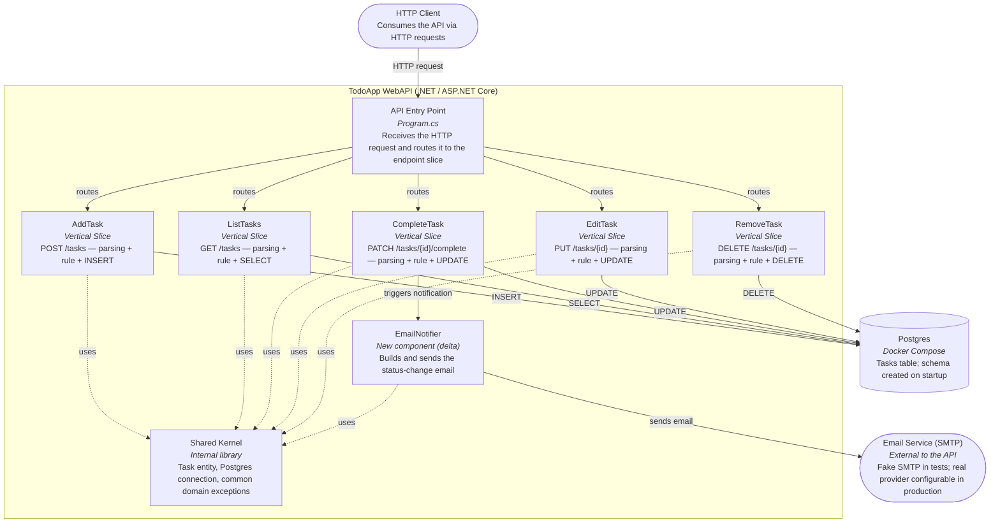

# Component Diagram (C4) — TodoApp WebAPI + Email Notification

Complements [c4-diagrama-componentes.md](c4-diagrama-componentes.md) (base diagram, still
valid and unchanged), showing the delta described in the brief
[202607220120-todo-app-notificacao-email-status-brief.md](202607220120-todo-app-notificacao-email-status-brief.md)
and decided in [ADR-0002](adr-0002-notificacao-email.md): a new `EmailNotifier` component,
triggered by the `CompleteTask` slice, which sends an email to an SMTP service external to
the API.

## Reading the diagram
- Everything that already existed in the base diagram stays the same — the delta is only
  `EmailNotifier` and the external `Email Service (SMTP)`, plus the new edge coming out of
  `CompleteTask`.
- `EmailNotifier` lives inside the API container (it is a component of the TodoApp WebAPI),
  but the email destination (`mail`) is external — that's why it sits outside the
  `subgraph cli`, just as Postgres already did.
- Only `CompleteTask` triggers `EmailNotifier` in this first version (see "Out of scope" in
  the brief) — the other slices (`AddTask`, `ListTasks`, `EditTask`, `RemoveTask`) have no
  edge to it.
- `EmailNotifier` uses the `Shared Kernel` (e.g., `Task` data to build the email body), but
  does not introduce a generic "Service" layer — it keeps the same vertical slice principle
  from [ADR-0001](adr-0001-vertical-slice.md), reinforced by
  [ADR-0002](adr-0002-notificacao-email.md) by deciding that the trigger lives within the
  `CompleteTask` slice itself.
