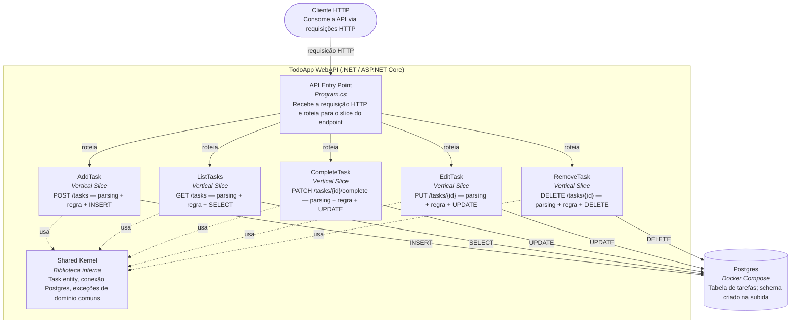

# Diagrama de Componentes (C4) — TodoApp WebAPI

Nível de **Componentes** do modelo C4, dentro do container "TodoApp WebAPI". Contexto maior:
1 cliente HTTP → TodoApp WebAPI (.NET / ASP.NET Core) → Postgres (Docker Compose). Este
diagrama detalha os componentes internos ao container da API, refletindo a decisão registrada
em [ADR-0001](adr-0001-vertical-slice.md): cada endpoint é um componente autocontido
(vertical slice), não uma camada compartilhada entre endpoints.

## Leitura do diagrama
- Cada slice (`AddTask`, `ListTasks`, `CompleteTask`, `EditTask`, `RemoveTask`) corresponde
  1:1 a um endpoint do backlog (`docs/202607211323-todo-app-brief.md`) e a um teste de integração próprio (via
  HTTP contra a API real).
- `Shared Kernel` é deliberadamente pequeno: só o que é genuinamente comum a todos os slices
  (entidade, conexão, exceções). Regra de negócio e acesso a dados específicos de cada
  endpoint não entram aqui.
- Não há Service ou Repository genérico compartilhado entre slices — ver
  [ADR-0001](adr-0001-vertical-slice.md) para a justificativa.
