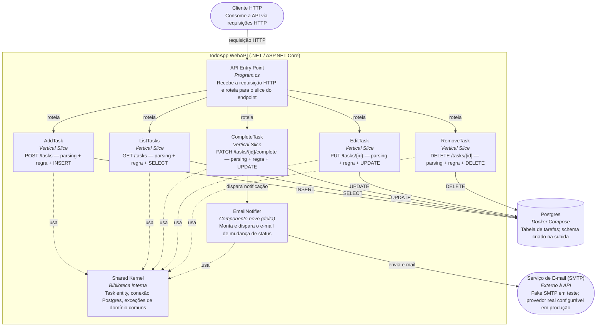

# Diagrama de Componentes (C4) — TodoApp WebAPI + Notificação por E-mail

Complementa [docs/c4-diagrama-componentes.md](../c4-diagrama-componentes.md) (diagrama base,
ainda válido e inalterado) mostrando o delta descrito no brief
[docs/draft/202607220120-todo-app-notificacao-email-status-brief.md](202607220120-todo-app-notificacao-email-status-brief.md)
e decidido em [ADR-0002](adr-0002-notificacao-email.md): um novo componente `EmailNotifier`,
acionado pelo slice `CompleteTask`, que dispara e-mail para um serviço SMTP externo à API.

## Leitura do diagrama
- Tudo que já existia no diagrama base permanece igual — o delta é só `EmailNotifier` e o
  `Serviço de E-mail (SMTP)` externo, mais a aresta nova saindo de `CompleteTask`.
- `EmailNotifier` vive dentro do container da API (é um componente do TodoApp WebAPI), mas o
  destino do e-mail (`mail`) é externo — por isso fica fora do `subgraph cli`, assim como o
  Postgres já ficava fora.
- Só `CompleteTask` aciona `EmailNotifier` nesta primeira versão (ver "Fora de escopo" no
  brief) — os demais slices (`AddTask`, `ListTasks`, `EditTask`, `RemoveTask`) não têm aresta
  para ele.
- `EmailNotifier` usa o `Shared Kernel` (ex.: dados da `Task` para montar o corpo do e-mail),
  mas não introduz uma camada de "Service" genérica — mantém o mesmo princípio de vertical
  slice do [ADR-0001](../adr-0001-vertical-slice.md), reforçado pelo [ADR-0002](adr-0002-notificacao-email.md)
  ao decidir que o disparo vive dentro do próprio slice `CompleteTask`.
